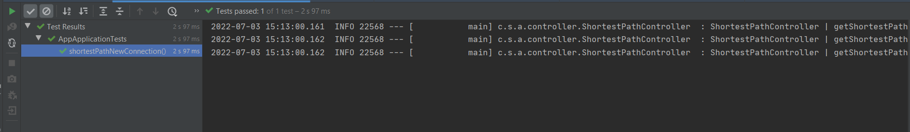

# Calculating Shortest Path through Noe4j in Spring Boot

### 📖 Information

<ul style="list-style-type:disc">
  <li>Its aims to calculate the shortest path in terms of total connection and duration between two nodes</li>
  <li>Here is the explanation of the project
      <ul>
        <li>Implement the process of CRUD for both City and its Route</li>
        <li>Use Dijkstra Single-Source Shortest Path algorithm supported by Neo4j to calculate the path</li>
      </ul>
  </li>
</ul>

### 🔨 Run the App

<b>1 )</b> Install <b>Docker Desktop</b>. Here is the installation <b>link</b> : https://docs.docker.com/docker-for-windows/install/

<b>2 )</b> Open <b>Terminal</b> under <b>resources</b> folder to run <b>Minio</b> on <b>Docker</b> Container
```
    docker-compose up -d
```
<b>3 )</b> Open <b>Neo4j Browser</b> in the brower
```
    
```

<b>4 )</b> Explore Rest APIs
<table style="width:100%">
  <tr>
    <th>Method</th>
    <th>Url</th>
    <th>Description</th>
    <th>Valid Request Body</th>
    <th>Valid Request Params</th>
    <th>No Request or Params</th>
  </tr>
  <tr>
      <td>GET</td>
      <td>getCityById</td>
      <td>Get City By Id</td>
      <td></td>
      <td><a href="README.md#getCityById">Info</a></td>
      <th></th>
  </tr>
  <tr>
      <td>GET</td>
      <td>getAllCities</td>
      <td>Get All Cities</td>
      <td></td>
      <td></td>
      <td><a href="README.md#getAllCities">Info</a></td>
  </tr>
  <tr>
      <td>GET</td>
      <td>getCityByName</td>
      <td>Get City By Name</td>
      <td></td>
      <td><a href="README.md#getCityByName">Info</a></td>
      <th></th>
  </tr>
</table>


### Used Dependencies
* Spring Boot Web
* Spring Boot Test
* Neo4j
* Docker
* Mapper

## Valid Request Body

##### <a id="">
```

```

## Valid Request Params

##### <a id="getCityById">Get City By Id
```
    http://localhost:8077/api/v1/city/id/{cityId}
```

##### <a id="getCityByName">Get City By Name
```
    http://localhost:8077/api/v1/city/name/{cityName}
```

## No Request or Params

##### <a id="getAllCities">Get All Cities
```
    http://localhost:8077/api/v1/city/cities
```


### Screenshots

<details>
<summary>Click here to show the screenshots of project</summary>
    <p> Figure 1 </p>
    
</details>    
    